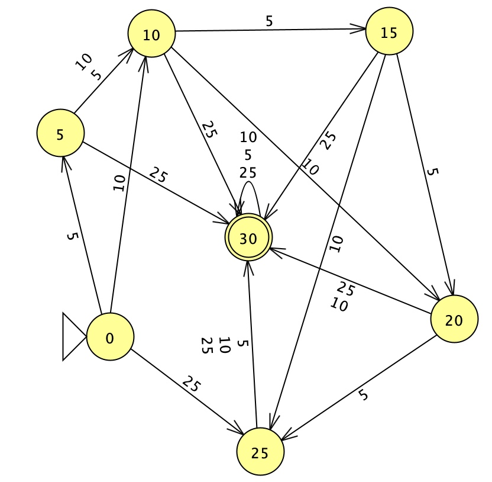

# 🕹️ PIXEL ARCADE

### Máquina de venda de fichas para arcade

**Trabalho 01 — Linguagens Formais e Autômatos**

## Sobre o projeto

O **PIXEL ARCADE** é uma máquina de venda de fichas para arcade, desenvolvida a partir da modelagem de um **Autômato Finito Determinístico (AFD)**.

A máquina aceita moedas de **5, 10 e 25 centavos** e libera uma ficha quando o valor inserido é **igual ou superior a 30 centavos**.

O funcionamento da máquina foi primeiro modelado no **JFLAP** e depois implementado em uma página web interativa.

## Funcionamento

O AFD possui os estados:

```text
0, 5, 10, 15, 20, 25 e 30
```

O estado `0` é o estado inicial e o estado `30` é o estado final.

Cada estado de `0` a `25` representa o valor acumulado pelas moedas inseridas. As entradas possíveis são:

- `5` centavos
- `10` centavos
- `25` centavos

Por exemplo, ao inserir:

```text
5 + 10 + 10 + 5 = 30 centavos
```

o caminho percorrido pelo AFD é:

```text
0 → 5 → 15 → 25 → 30
```

Ao chegar ao estado final `30`, uma ficha é liberada.

### Estado final

O estado `30` funciona como um **estado absorvente**, representando valores **iguais ou superiores a 30 centavos**.

Assim, depois que o autômato chega ao estado `30`, qualquer nova moeda mantém o autômato nesse mesmo estado:

```text
30 --5--> 30
30 --10--> 30
30 --25--> 30
```

Por exemplo, ao inserir:

```text
25 + 10 = 35 centavos
```

o caminho percorrido pelo AFD é:

```text
0 → 25 → 30
```

Mesmo que o valor real inserido seja 35 centavos, o AFD permanece no estado `30`, pois esse estado representa qualquer valor igual ou superior a 30 centavos.

Na aplicação, o valor real inserido é controlado separadamente para permitir o gerenciamento do saldo. Nesse exemplo, uma ficha é liberada e os **5 centavos restantes permanecem como saldo para a próxima compra**. A máquina não devolve troco.

## Modelagem no JFLAP

O autômato foi desenvolvido e testado utilizando o **JFLAP**.



O arquivo do autômato utilizado no JFLAP está disponível neste repositório como `jflapofical.jff`.

O AFD possui o estado `30` como estado final e absorvente. Dessa forma, todas as entradas possíveis a partir desse estado retornam para o próprio estado `30`.

## Interface

Para a implementação, foi escolhida a ideia de uma **máquina de fichas para arcade**, utilizando uma estética retrô.

A interface permite:

- inserir moedas de 5, 10 e 25 centavos;
- visualizar o crédito acumulado;
- visualizar as fichas liberadas;
- visualizar o saldo restante;
- finalizar a compra.

Também foi criada uma opção para **visualizar o funcionamento do AFD**.

Nessa área são mostrados:

- o estado atual;
- a última moeda inserida;
- a transição realizada;
- o valor acumulado.

## Tecnologias utilizadas

- HTML
- CSS
- JavaScript
- JFLAP
- GitHub Pages

## Acesso online

O projeto pode ser testado através do GitHub Pages:

**[Acessar o PIXEL ARCADE](https://robertagalardao.github.io/Pixel-Arcade/)**

## Autores

**Roberta Elis Galardão**

Trabalho desenvolvido para a disciplina de **Linguagens Formais e Autômatos**.